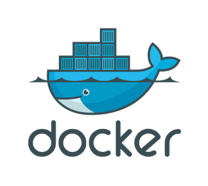

#### M300 LB3
# Docker



In diesem Markdown-Text werde ich Schritt-für-Schritt die Befehle und Abläufe beschreiben, welche ich gemacht habe um einen Apache-Webserver per Vagrant und Docker zu erstellen.

#### Ablauf

Als erstes muss eine VM erstellt werden, auf dem später der Webserver laufen wird. Dies macht man in der GitHub-Shell und wird mit folgenden Befehlen gemacht.

```sh
$ vagrant up
$ vagrant ssh
```

Danch sollte im Shell folgendes angezeigt werden:


Nun muss man den Apache-Service installieren. Dafür muss man als erstes einen Docker-Container erstellen. Dies wird mit folgenden Befehlen gemacht.

```sh
cd /vagrant/apache
docker build -t apache .
```

Nun wird der Container erstellt:


Nun muss man den Container starten:

```sh
docker run --rm -d -p 8080:80 -v `pwd`/web:/var/www/html --name apache apache
```

Als nächstes kann man mit folgendem Befehl die Funktionsfähigkeit der Webseite überprüfen:
```sh
curl http://localhost:8080
```

Danach sollte es im Shell so aussehen:


Somit ist die Webseite startklar und der Prozess somit abgeschlossen.
